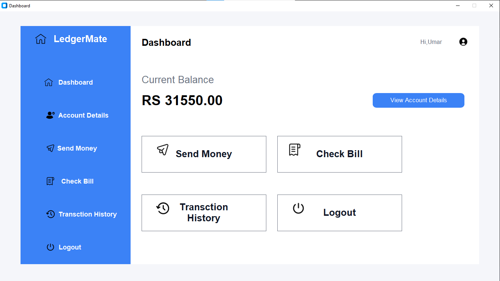
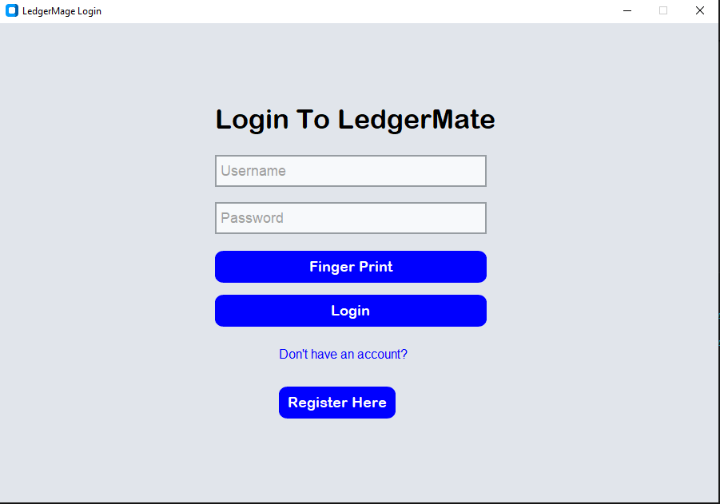
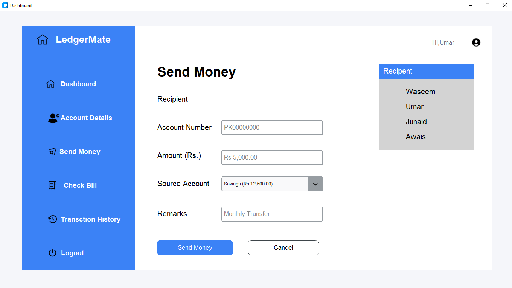
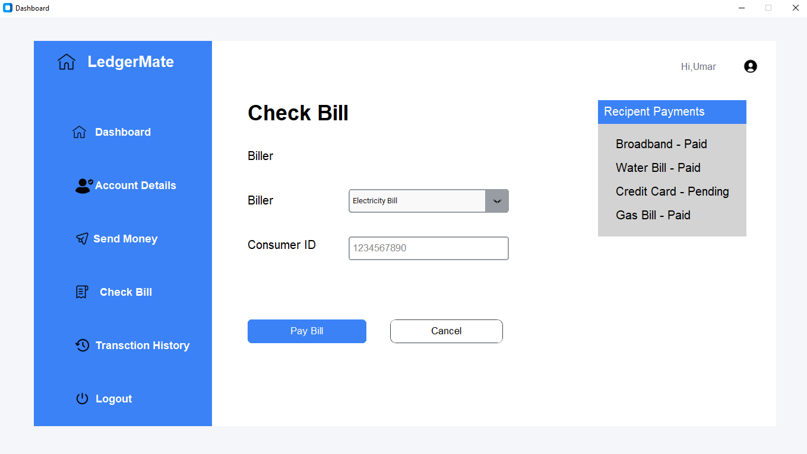
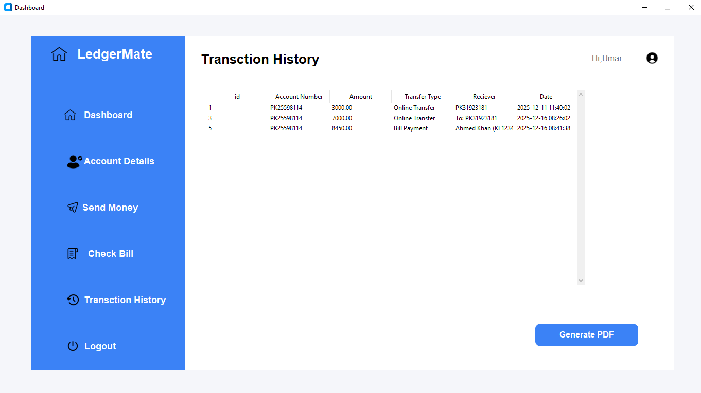

# LedgerMage – Personal Account Management System

A modern **desktop application** for personal account management, built as a Semester Project for Software Engineering.  
It offers secure user registration, real-time balance tracking, account-to-account transfers, bill checking, transaction history, and professional PDF report generation.



## ✨ Features

- Secure **Registration** & **Login** system with MySQL database
- Clean, modern GUI using **CustomTkinter**
- Relational database design (foreign keys, cascades, default balance of 50,000 PKR)
- Real-time **Dashboard** with current balance overview
- **Account-to-Account** money transfer with balance validation & transaction logging
- **Transaction History** with table view
- **Bill Checking** utility (Electricity, Gas, PTCL) – opens official websites
- Professional **PDF Reports**:
  - Full Account Details summary
  - Complete Transaction History export
- Input validation, exception handling & user-friendly messages

## 🛠️ Tech Stack

- **Language**: Python 3
- **GUI**: CustomTkinter + tkinter + tkcalendar
- **Database**: MySQL (mysql-connector-python)
- **PDF Generation**: FPDF
- **Other Libraries**: Pillow (PIL), datetime, random, re, os, webbrowser

## 📸 Screenshots

Here are some glimpses of **LedgerMage** in action:

### Login Screen


### Registration Page


### Main Dashboard


### Account Details


### Send Money Feature


### Bill Checking Utility


### Transaction History


## 🚀 Getting Started

### Prerequisites

- Python 3.8 or higher
- MySQL Server (running on localhost)
- Required Python packages:
  ```bash
  pip install customtkinter mysql-connector-python fpdf Pillow tkcalendar
